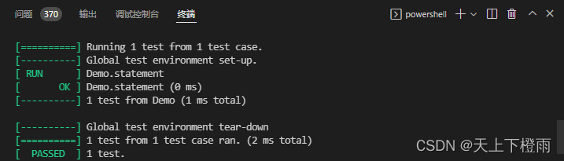

## 1 前言

近期，李先静李老师向我们推荐了《重构：改善既有代码的设计》这本书，它是一本非常经典的著作，书中清晰揭示了重构的过程，解释了重构的原理和最佳实践方式，并给出了何时以及何地应该开始挖掘代码以求改善，可用来改善既有代码的设计、提升软件的可维护性，又可用于使既有代码更易理解、焕发出新的活力。

因此，往后每周会花费一些时间来阅读总结本书，希望自己能学习到中的精华，有所成长，并且后续大多数的博客内容将会围绕对该书的学习展开。

此处非常感谢李老师的推荐指导，李老师博客地址：[http://blog.csdn.net/absurd](http://blog.csdn.net/absurd)。

## 2 何为重构

书中提到所谓重构（refactoring）是这样一个过程：**在不改变代码外在行为的前提下**，对代码做出修改，以改进程序的内部结构。

### 2.1 重构的前提

这里需要重点注意的是重构的前提：**不改变代码外在的行为**，也就是说重构的出发点是改善现有的代码，而不是说直接将现有的代码推倒重写，当我们挖掘代码时，很快发现了一些值得修改的地方，于是越挖越深，找到值得被修改的地方越多，最后很容易跳进自己挖的大坑，却爬不出去，我们在重构的过程中时刻警惕这一点，记住重构的前提条件，避免自掘坟墓。

重构是一种经千锤百炼形成的有条不紊的**程序整理方法**，可以最大限度地减小整理过程中引入错误的概率。本质上说，**重构就是在代码写好之后改进它的设计**。

### 2.2 设计与重构的关系

大部分人包括我自己都相信一个观点：程序实现的流程应该是现设计后编码，首先得有良好的设计架构，然后才能开始编码。

这个观点当然是正确的，但随着时间流失，代码被不断修改，原有设计所得的系统，整体结构逐渐衰弱，代码质量慢慢降低，编码工作从一开始严谨的工程逐渐变得随性行为。

**重构的过程刚好与此相反**。即使现在我们面前摆着一个糟糕的设计以及混乱的代码，我们也可以通过重构将它们加工成设计良好的代码。

非常重要的一点，重构的每个步骤都很简单，比如：

- 把某个字段从一个类移到另一个类；
- 把某些代码从一个函数拉出来构成另一个函数；
- 在继承体系中把某些代码推上推下；
- 等等......

但是不要小看这些细微的修改，它们积累起来，就可以慢慢改善代码质量，达到一定程度就可以实现系统设计的改善。

如果说随着项目代码的不断修改，软件会慢慢腐烂，那么重构就是减缓甚至是逆转这一过程的良药。**在系统构建的过程中，通过"重构-设计"的反复互动，可以让一个程序在开发过程中持续保有良好的设计。**

## 3 通过示例了解重构

在《重构：改善既有代码的设计 》中，作者选用了 JavaScript 来展示书中的重构手法，这里我自己将才用 C/C++ 进行总结记录，自己熟悉这些语言的同时也能加理解。当然，使用何种语言并不影响我们对重构的学习和理解，只是我自己更熟悉 C/C++ 而已。

> 备注：为了方便自己开发演示，我会使用开源 GUI 引擎 [AWTK](https://www.zlg.cn/index/pub/awtk.html) 提供的一些库函数，比如字符串、对象、动态数组、链表、读写缓冲区、JSON解析等功能，感兴趣的可以去 [GitHub](https://github.com/zlgopen/awtk) 上下载源码。

### 3.1 示例简介

设想有一个戏剧演出团，演员们经常要去各种场合表演戏剧。通常客户（customer）会指定几出剧目，而剧团则根据观众（audience）人数及剧目类型来向客户收费。该团目前出演两种戏剧：悲剧（tragedy）和喜剧（comedy）。

给客户发出账单时，剧团还会根据到场观众的数量给出“观众量积分”（volume credit）优惠，下次客户再请剧团表演时可以使用积分获得折扣——你可以把它看作一种提升客户忠诚度的方式。

### 3.2 数据存储

该剧团将剧目的数据存储在一个简单的JSON文件中。

```json
/* plays.json */
{
    "hamlet": {
        "name": "Hamlet",
        "type": "tragedy"
    },
    "as_like": {
        "name": "As You Like It",
        "type": "comedy"
    },
    "othello": {
        "name": "Othello",
        "type": "tragedy"
    }
}
```

该剧团将剧目的数据存储在一个简单的JSON文件中。

```json
/* invoices.json */
[
    {
        "customer": "BigCo",
        "performances": [
            {
                "playID": "hamlet",
                "audience": 55
            },
            {
                "playID": "as_like",
                "audience": 35
            },
            {
                "playID": "othello",
                "audience": 40
            }
        ]
    }
]
```

### 3.3 原始示例代码

下面这个简单的函数用于打印账单详情：

```c
/* statement.c */
#define STATEMENT_SIZE 1024

str_t* statement(tk_object_t* invoice, tk_object_t* plays) {
  double_t total_amount = 0;
  uint32_t volume_credits = 0;
  str_t* result = TKMEM_ZALLOC(str_t);
  const char* customer = tk_object_get_prop_str(invoice, "[0].customer");
  tk_object_t* performances = tk_object_get_prop_object(invoice, "[0].performances");
  uint32_t perf_num = tk_object_get_prop_uint32(performances, TK_OBJECT_PROP_SIZE, 0);

  str_init(result, 0);
  str_append_format(result, STATEMENT_SIZE, "Statement for %s\n", customer);

  for (uint32_t i = 0; i < perf_num; i++) {
    value_t v;
    uint32_t audience = 0;
    double_t curr_amount = 0;
    tk_object_t* perf = NULL;
    tk_object_t* play = NULL;
    const char* play_id = NULL;
    const char* play_name = NULL;
    const char* play_type = NULL;

    object_array_get(performances, i, &v);
    perf = value_object(&v);
    play_id = tk_object_get_prop_str(perf, "playID");
    audience = tk_object_get_prop_uint32(perf, "audience", 0);

    play = tk_object_get_prop_object(plays, play_id);
    play_name = tk_object_get_prop_str(play, "name");
    play_type = tk_object_get_prop_str(play, "type");

    if (tk_str_eq(play_type, "tragedy")) {
      curr_amount = 40000;
      if (audience > 30) {
        curr_amount += 1000 * (audience - 30);
      }
    } else if (tk_str_eq(play_type, "comedy")) {
      curr_amount = 30000;
      if (audience > 20) {
        curr_amount += 10000 + 500 * (audience - 20);
      }
      curr_amount += 300 * audience;
    } else {
      log_info("unknow type: %s", play_type);
    }

    /* 增加观众量积分 */
    volume_credits += tk_max(audience - 30, 0);
    /* 每增加10名戏剧观众可以获得额外积分 */
    if (tk_str_eq(play_type, "comedy")) {
      volume_credits += floor(audience / 5);
    }

    total_amount += curr_amount;

    /* 格式化输出每个剧目的收费 */
    str_append_format(result, STATEMENT_SIZE, "  %s: $%0.2f (%d seats)\n", play_name,
                      curr_amount / 100, audience);
  }

  /* 格式化输出总收费和获得的积分 */
  str_append_format(result, STATEMENT_SIZE, "Amount owed is $%.2f\n", total_amount / 100);
  str_append_format(result, STATEMENT_SIZE, "You earned %d credits\n", volume_credits);

  return result;
}
```

将 plays.json 和 invoices.json 转化成两个 object_t 类型的对象，传入上面的 statement() 函数，将得到的 result 结果打印出来，输出如下：

```bash
Statement for BigCo
  Hamlet: $650.00 (55 seats)
  As You Like It: $580.00 (35 seats)
  Othello: $500.00 (40 seats)
Amount owed is $1730.00
You earned 47 credits
```

### 3.4 代码的缺陷以及为什么要重构它

上面的示例代码最大的问题就是**结构不清晰，功能都耦合在一起，难以进行后续的扩展**，这是一个非常小的程序，这么小的程序不做任何深入的设计，将所有功能都放在一个 statement() 函数里面也不会太难理解，但如果这段代码放在一个更大规模的系统中，阅读起来很难看，而且理解也比较困难。

> 备注：虽然示例代码的结构很难看，但这个程序还是能正常跑的，编译器也不会在乎代码好不好看（理解），这里所谓"难看"是指从"人"的角度，也就是程序员的角度来讲，一段代码难以阅读且难以修改，并且人是会犯错的，一旦修改，就可能会引入新的bug，这是没有办法避免的。

当我们自己修改某段程序代码时，我们肯定希望这段代码能有良好的结构，并且已经被拆分成一系列函数或其他的类型、对象等，这样我们能更容易看懂这段代码在干什么。

因此，**如果程序杂乱无章，先为它整理出结构来，再做需要的修改，通常来说更加简单**。

针对上面的示例，我们可以试想以下情况：

* 假如我们希望以 HTML 格式输出详情清单：必须在每处给 result 追加字符串时添加分支逻辑，并且如果后续一旦计费逻辑发生编码，就必须同时修改两个地方。
* 假如演员们尝试表演更多类型的戏剧，比如历史剧、田园剧、歌剧、舞剧等，戏剧场次的计费方式、积分方式都可能需要修改，这会导致 statement() 函数的代码越来越臃肿且复杂。

可以看出，如果不对 statement() 函数进行重构，在其原有基础上新增需求，随着规则越来越复杂，整个函数会变得非常庞大，并且在修改过程中也很容易发生改漏、改错等问题。

> 备注：如果你要给程序添加一个特性，但发现代码因缺乏良好的结构而不易于进行更改，那就先重构那个程序，使其比较容易添加该特性，然后再添加该特性。

这里书中提到了一个重点，**是需求的变化使重构变得必要**。如果一段代码能正常工作，并且不会再被修改，那么完全可以不去重构它。

从此也可以看出，**只有当这段代码存在这被人阅读、被人修改的需求时，我们才有必要去重构它**。

### 3.5 重构前的准备工作

在重构一段代码前有一个必须要作的准备工作，那就是**确保即将被修改的代码拥有一组可靠的测试**。

即使我们的能力出类拔萃，但我们依旧是人，有犯错的可能性，并且程序越大出错的概率越高，为了避免在重构过程中引入新的bug，并且节省调试时间，提高开发效率，这些测试比不可少。

statement() 函数的返回值是一个字符串，因此只需弄几张新的账单，检查该函数输出的字符串是否与预期的一致即可，这里为了方便演示，仍采用上文中的 plays.json 和 invoices.json ，在实际应用中是没有这么简单的。我习惯使用 **gTest** 工具来进行单元测试，测试代码如下：

> 备注：gTest 是一个由google公司发布的跨平台(Liunx、Mac OS X、Windows、Cygwin、Windows CE and Symbian)的C++测试框架。可以在 [GitHub](https://github.com/google/googletest) 上下载，我这里直接借用了 [AWTK](https://github.com/zlgopen/awtk) 中内置的 gTest（awtk/3rd/gtest）。

```c
/* demo.cc */
#include <string>
#include "tkc/str.h"
#include "tkc/mem.h"
#include "gtest/gtest.h"
#include "../src/statement.h"

using std::string;

TEST(Demo, statement) {
/* 期望的输出信息 */
  const char* text =
      "Statement for BigCo\n"
      "  Hamlet: $650.00 (55 seats)\n"
      "  As You Like It: $580.00 (35 seats)\n"
      "  Othello: $500.00 (40 seats)\n"
      "Amount owed is $1730.00\n"
      "You earned 47 credits\n";
  
  /* 将plays.json和invoice.json转化为obj对象 */
  ...
  
  str_t* result = statement(invoice, plays);

  /* statement()函数的输出结果是否与期望一致 */
  ASSERT_EQ(str_eq(result, text), TRUE);

  /* 释放相关资源 */
  str_reset(result);
  TKMEM_FREE(result);
}
```

运行单元测试的输出结果如下：



> 备注：测试程序对结果的报告方式是很重要的，它们要么变绿，表示测试通过，要么就变红，然后列出失败清单并提示失败的行号，这样能帮助我们快速了解程序的情况并针对问题进行修改，不必花大量时间来回对比代码，提高开发速度。

**重构前，先检查自己是否有一套可靠的测试集。这些测试必须有自我检验能力。**

### 3.6 拆解statement()函数

首先是 statement() 函数中的用来计算一场戏剧演出费用的 if...else... 语句，这段代码可以抽取成一个独立的函数，将其命名为 amount_for_perf。

#### 3.6.1 提炼函数

书中介绍了将一块代码抽取成一个函数时的标准流程——提炼函数：

1. 检查提炼函数时有哪些变量会离开原本的作用域。在此示例中，有perf 、play、curr_amount 。前两个变量会被提炼后的函数使用，但不会被修改，可以以参数的方式传递给提炼后的函数。curr_amount 是会被修改变量，因此可以作为函数返回值，代码如下：

```c
/* statement.c */
static double_t amount_for_perf(tk_object_t* perf, tk_object_t* play) {
  double_t curr_amount = 0;
  uint32_t audience = tk_object_get_prop_uint32(perf, "audience", 0);
  const char* play_name = tk_object_get_prop_str(play, "name");
  const char* play_type = tk_object_get_prop_str(play, "type");

  if (tk_str_eq(play_type, "tragedy")) {
    curr_amount = 40000;
    if (audience > 30) {
      curr_amount += 1000 * (audience - 30);
    }
  } else if (tk_str_eq(play_type, "comedy")) {
    curr_amount = 30000;
    if (audience > 20) {
      curr_amount += 10000 + 500 * (audience - 20);
    }
    curr_amount += 300 * audience;
  } else {
    log_info("unknow type: %s", play_type);
  }

  return curr_amount;
}
```

此时，在原来的 statement() 函数里就可以直接调用这个新函数来初始化 curr_amount 变量了，**修改后编译程序并运行一下测试程序，确保修改正确**。

> 备注：测试是重构中非常重要的步骤，重构技术就是以微小的步伐修改程序。如果你犯下错误，通过测试程序很容易就可以发现它。

2. 完成提炼函数后，看看是否能进一步提升其表达能力，第一步一般是给变量改名，使它们更简洁，比如这里可以将 curr_amount 重命名为 result，方便我们一眼知道它的作用，修改后记得编译、测试、提交。

3. 接着我们可以看看函数的参数是否有更清晰的命名方式，比如给函数参数加上类型，让代码更加容易理解，将这里的 perf参数重命名为 a_performance，然后编译、测试、提交。

**为什么要在变量名上花这么多功夫？有必要吗？**

当然有必要！！！好的代码应该能清楚地表明他在做什么，而变量命名时代码清晰的关键，只要改名能提升代码的可读性，那就应该去做。


#### 3.6.2 查询取代临时变量

仔细观察 amount_for_perf 函数的参数：

- a_performance 从循环变量中来，每次循环都会改变。
- play 是由 performance 变量计算得到的，因此根本没必要将它作为参数传入，可以在 amount_for_perf () 函数中计算得到。

> 备注：分解一个长函数时，可以将 play 这样的变量移除掉，因为它们创建了很多具有局部作用域的临时变量，这会使提炼函数更加复杂。

首先，将计算 play 变量的过程提炼为一个函数，代码如下：

```c
/* statement.c */
static tk_object_t* play_for_perf(tk_object_t* a_performance, tk_object_t* plays) {
  const char* play_id = tk_object_get_prop_str(a_performance, "playID");
  return tk_object_get_prop_object(plays, play_id);
}
```

然后，将 amount_for_perf() 函数和 statement() 中使用到 play 变量的地方改为调用以上函数，代码如下：

```c
static double_t amount_for_perf(tk_object_t* a_performance, tk_object_t* plays) {
  double_t result = 0;
  uint32_t audience = tk_object_get_prop_uint32(a_performance, "audience", 0);
  const char* play_name = tk_object_get_prop_str(play_for_perf(a_performance, plays), "name");
  const char* play_type = tk_object_get_prop_str(play_for_perf(a_performance, plays), "type");

  if (tk_str_eq(play_type, "tragedy")) {
    result = 40000;
    if (audience > 30) {
      result += 1000 * (audience - 30);
    }
  } else if (tk_str_eq(play_type, "comedy")) {
    result = 30000;
    if (audience > 20) {
      result += 10000 + 500 * (audience - 20);
    }
    result += 300 * audience;
  } else {
    log_info("unknow type: %s", play_type);
  }

  return result;
}

str_t* statement(tk_object_t* invoice, tk_object_t* plays) {
  double_t total_amount = 0;
  uint32_t volume_credits = 0;
  str_t* result = TKMEM_ZALLOC(str_t);
  const char* customer = tk_object_get_prop_str(invoice, "[0].customer");
  tk_object_t* performances = tk_object_get_prop_object(invoice, "[0].performances");
  uint32_t perf_num = tk_object_get_prop_uint32(performances, TK_OBJECT_PROP_SIZE, 0);

  str_init(result, 0);
  str_append_format(result, STATEMENT_SIZE, "Statement for %s\n", customer);

  for (uint32_t i = 0; i < perf_num; i++) {
    value_t v;
    uint32_t audience = 0;
    double_t curr_amount = 0;
    tk_object_t* perf = NULL;
    const char* play_name = NULL;
    const char* play_type = NULL;

    object_array_get(performances, i, &v);
    perf = value_object(&v);
    audience = tk_object_get_prop_uint32(perf, "audience", 0);
    curr_amount = amount_for_perf(perf, plays);

    play_name = tk_object_get_prop_str(play_for_perf(perf, plays), "name");
    play_type = tk_object_get_prop_str(play_for_perf(perf, plays), "type");

    /* 增加观众量积分 */
    volume_credits += tk_max(audience - 30, 0);
    /* 每增加10名戏剧观众可以获得额外积分 */
    if (tk_str_eq(play_type, "comedy")) {
      volume_credits += floor(audience / 5);
    }

    total_amount += curr_amount;

    /* 格式化输出每个剧目的收费 */
    str_append_format(result, STATEMENT_SIZE, "  %s: $%0.2f (%d seats)\n", play_name,
                      curr_amount / 100, audience);
  }

  /* 格式化输出总收费和获得的积分 */
  str_append_format(result, STATEMENT_SIZE, "Amount owed is $%.2f\n", total_amount / 100);
  str_append_format(result, STATEMENT_SIZE, "You earned %d credits\n", volume_credits);

  return result;
}
```

需要注意的是，重构前 play 变量的代码在每次循环中只执行了1次，而重构后却执行了3次。书中提到会在后面探讨重构与性能之间的关系，但在这里为了改进代码的结构，就先这样写了，后续再对结构良好的代码进行性能优化也比之前容易得多。

> 备注：移除局部变量的好处就是做提炼时会简单得多，因为需要操心的局部作用域变少了。

#### 3.6.3 内联变量手法

观察一下 amount_for_perf() 函数的调用，它的结果被赋值给一个临时变量，之后就不再被修改，因此可以采用内联变量手法内联它。

即在使用到 curr_amount 的地方直接调用该函数，然后把 curr_amount 这个临时变量删除，代码如下：

```c
str_t* statement(tk_object_t* invoice, tk_object_t* plays) {
  double_t total_amount = 0;
  uint32_t volume_credits = 0;
  str_t* result = TKMEM_ZALLOC(str_t);
  const char* customer = tk_object_get_prop_str(invoice, "[0].customer");
  tk_object_t* performances = tk_object_get_prop_object(invoice, "[0].performances");
  uint32_t perf_num = tk_object_get_prop_uint32(performances, TK_OBJECT_PROP_SIZE, 0);

  str_init(result, 0);
  str_append_format(result, STATEMENT_SIZE, "Statement for %s\n", customer);

  for (uint32_t i = 0; i < perf_num; i++) {
    value_t v;
    uint32_t audience = 0;
    tk_object_t* perf = NULL;
    const char* play_name = NULL;
    const char* play_type = NULL;

    object_array_get(performances, i, &v);
    perf = value_object(&v);
    audience = tk_object_get_prop_uint32(perf, "audience", 0);

    play_name = tk_object_get_prop_str(play_for_perf(perf, plays), "name");
    play_type = tk_object_get_prop_str(play_for_perf(perf, plays), "type");

    /* 增加观众量积分 */
    volume_credits += tk_max(audience - 30, 0);
    /* 每增加10名戏剧观众可以获得额外积分 */
    if (tk_str_eq(play_type, "comedy")) {
      volume_credits += floor(audience / 5);
    }

    total_amount += amount_for_perf(perf, plays);

    /* 格式化输出每个剧目的收费 */
    str_append_format(result, STATEMENT_SIZE, "  %s: $%0.2f (%d seats)\n", play_name,
                      amount_for_perf(perf, plays) / 100, audience);
  }

  /* 格式化输出总收费和获得的积分 */
  str_append_format(result, STATEMENT_SIZE, "Amount owed is $%.2f\n", total_amount / 100);
  str_append_format(result, STATEMENT_SIZE, "You earned %d credits\n", volume_credits);

  return result;
}
```

## 4 总结

到此为止，书的第一章内容也看了大半了，以上是书中一开始简单介绍的最简单、最常用的三种重构手法，我自己读下来最大体会就是对重构有了一个初步的了解，惊叹于作者对重构步骤的拆分之细，粒度非常小。

重构在我这里不再是一种抽象的概念，变成了严谨的、具有条理性的行为，它不是偶尔的灵光一闪，而是日积月累的改善，并且作者让我再次认识到了程序单元测试的重要性，一个结构良好、运行稳定的程序离不开完善高效的测试代码。
